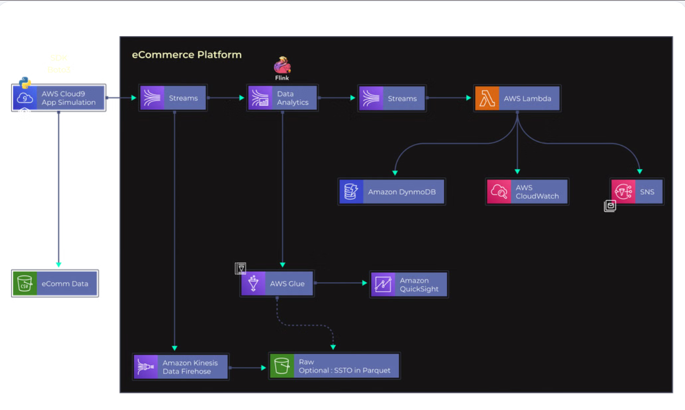

# Build an Analytical Platform for eCommerce using AWS Services

An end-to-end data engineering platform built on AWS. The platform ingests, processes, and analyzes high-throughput eCommerce clickstream events across two analytical pipelines: **Real-Time Anomaly Detection** and **Batch Historical Analytics**.

---

## 🏛 Architecture Diagram



---

## 🔄 Data Flow

### Real-Time Pipeline (DDoS / Bot Detection)
```
Python App (simulate_kinesis_stream.ipynb)
       │
       ▼
Kinesis Data Stream (ecomm-events-stream)  ◄── also → Firehose → S3 raw-stream/
       │
       ▼
Apache Flink — ecomm-ddos-detector (Zeppelin)
[1-min tumbling window: flag users with >5 events/min]
       │
       ▼
Kinesis Data Stream (ecomm-alerts-stream)
       │
       ▼
AWS Lambda (ecomm-alert-processor)
       │
   ┌───┼──────────┐
   ▼   ▼          ▼
DynamoDB  CloudWatch  SNS (Email Alert)
(ecomm-suspicious-users)  (ecomm-ddos-monitor)
```

### Batch Pipeline (Historical Analytics)
```
Amazon Data Firehose (ecomm-firehose-str)
       │
       ▼
S3 raw-stream/ (GZIP JSON)
       │
       ▼
AWS Glue Crawlers → ecomm_flink_db catalog
       │
       ▼
Glue ETL Job (etl_to_parquet.py → Snappy Parquet, partitioned by event_type)
       │
       ▼
Amazon Athena (4 analytical views)
       │
       ▼
Amazon QuickSight (Dashboards)
```

---

## 🛠 Tech Stack & AWS Services

| Layer | Service |
|-------|---------|
| **Ingestion** | Amazon Kinesis Data Streams, Amazon Data Firehose |
| **Stream Processing** | Amazon Managed Service for Apache Flink (Zeppelin 3.0) |
| **Serverless Compute** | AWS Lambda (Python 3.12) |
| **Storage** | Amazon S3 (Data Lake), Amazon DynamoDB (NoSQL) |
| **Batch ETL** | AWS Glue Crawlers, AWS Glue PySpark ETL |
| **Query Engine** | Amazon Athena |
| **BI Dashboard** | Amazon QuickSight |
| **Monitoring & Alerts** | Amazon CloudWatch, Amazon SNS |
| **Languages** | Python 3, SQL, PySpark |

---

## 📂 Repository Structure

```
├── 2026-Jun-sample.csv              # Synthetic eCommerce clickstream dataset (~100k events)
├── Changed_Architecture_Diagram.png # Architecture Diagram
├── SESSION_STARTUP.md               # ⭐ Session startup guide (CLI commands)
├── simulate_kinesis_stream.ipynb    # Real-time event generator → Kinesis Stream
├── simulate_stream.ipynb            # Event generator → Amazon Data Firehose
├── lambda_alert_processor.py        # Lambda: DynamoDB + CloudWatch + SNS
├── etl_to_parquet.py                # Glue PySpark ETL: JSON → Parquet
├── create_quicksight_datasets.py    # QuickSight dataset registration
├── dashboard.json                   # CloudWatch dashboard config
├── zeppelin_setup.py                # Flink SQL reference (Zeppelin setup)
├── glue-trust.json                  # IAM trust policy — Glue
├── lambda-trust.json                # IAM trust policy — Lambda
├── qs-trust.json                    # IAM trust policy — QuickSight
└── qs-policy.json                   # IAM inline policy — QuickSight Athena+S3
```

---

## 🚀 How to Run End-to-End

> See [SESSION_STARTUP.md](SESSION_STARTUP.md) for full step-by-step CLI commands.

### Step 1: Start Streaming Infrastructure (AWS CLI — PowerShell)
```powershell
# Create Kinesis Streams (ephemeral — recreate each session)
aws kinesis create-stream --stream-name ecomm-events-stream --stream-mode-details StreamMode=ON_DEMAND --region us-east-1
aws kinesis create-stream --stream-name ecomm-alerts-stream --stream-mode-details StreamMode=ON_DEMAND --region us-east-1

# Re-enable Lambda trigger
aws lambda update-event-source-mapping --uuid 5b61f29c-44d5-4164-a8bc-10ceeb3f3d98 --enabled --region us-east-1

# Start Flink Studio Notebook
aws kinesisanalyticsv2 start-application --application-name ecomm-ddos-detector --region us-east-1
```

### Step 2: Configure Flink SQL (Apache Zeppelin — Browser)
1. Open AWS Console → Kinesis Analytics → `ecomm-ddos-detector` → **Open Apache Zeppelin**
2. Run 3 SQL cells: Source table → Sink table → INSERT anomaly detection

### Step 3: Stream Data from VS Code
```
Run: simulate_kinesis_stream.ipynb  → sends to ecomm-events-stream
Run: simulate_stream.ipynb          → sends to Firehose → S3
```

### Step 4: Verify Results
- **DynamoDB** `ecomm-suspicious-users` → flagged bot entries appear
- **CloudWatch** `ecomm-ddos-monitor` → real-time metric spikes
- **Email** `mindofyaseen@gmail.com` → SNS DDoS alert notifications
- **S3** `raw-stream/` → GZIP files from Firehose

---

## 💡 Flink Anomaly Detection Logic

```sql
-- Users with >5 events in a 1-minute window are flagged as suspicious
INSERT INTO ecomm_alerts_sink
SELECT
    user_id,
    COUNT(*) AS event_count,
    TUMBLE_START(event_arrival_time, INTERVAL '1' MINUTE) AS window_start,
    TUMBLE_END(event_arrival_time, INTERVAL '1' MINUTE) AS window_end
FROM ecomm_events
GROUP BY user_id, TUMBLE(event_arrival_time, INTERVAL '1' MINUTE)
HAVING COUNT(*) > 5
```

---

## 📊 Athena Analytical Views

| View | Insight |
|------|---------|
| `v_unique_visitors_daily` | Daily unique visitor count |
| `v_cart_abandonment` | Cart abandonment rate (~85.4%) |
| `v_top_categories_hourly` | Top product categories by hour |
| `v_brand_insights` | Brand marketing performance |

---

## 💰 Cost Management

**Ephemeral (delete each session):** Flink Studio + On-Demand Kinesis Streams → hourly billing
```powershell
aws kinesisanalyticsv2 stop-application --application-name ecomm-ddos-detector --region us-east-1
aws kinesis delete-stream --stream-name ecomm-events-stream --region us-east-1
aws kinesis delete-stream --stream-name ecomm-alerts-stream --region us-east-1
```

**Zero idle cost:** S3, Glue Catalog, Lambda, DynamoDB (Pay-Per-Request), CloudWatch, SNS, Athena

---

## AWS Environment

- **Account:** 989864147584
- **Region:** us-east-1 (N. Virginia)
- **S3 Bucket:** `ecomm-analytics-yaseen-2026`
- **Glue DB:** `ecomm_flink_db`

---

*AWS eCommerce Analytics Platform | Maintained by Muhammad Yaseen*
