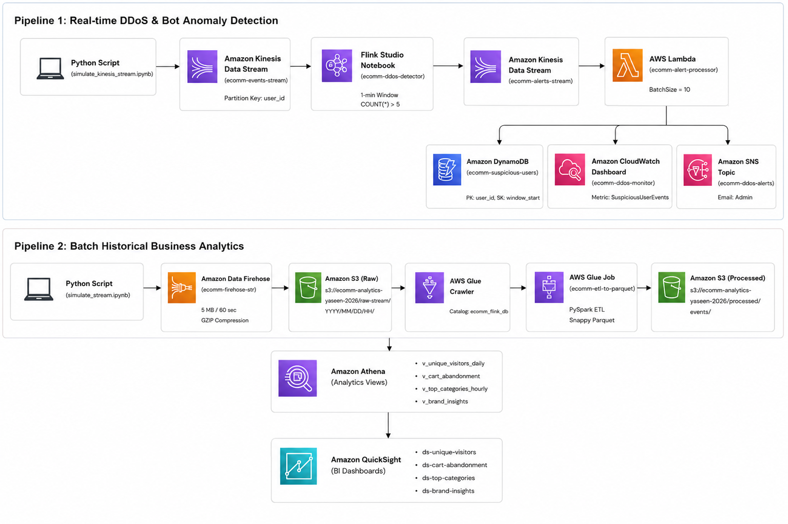

# Build an Analytical Platform for eCommerce using AWS Services

An end-to-end data engineering platform built on AWS following the official **ProjectPro Reference Architecture**. The platform ingests, processes, and analyzes high-throughput eCommerce clickstream events across two analytical pipelines: Real-Time Anomaly Detection and Batch Historical Analytics.

---

## 🏛 Official Architecture Diagram



---

## 🛠 Tech Stack & AWS Services

* **Languages:** Python 3, SQL, PySpark
* **Data Simulation & Ingestion:** Python Boto3 (VS Code), Amazon Kinesis Data Streams, Amazon Data Firehose
* **Stream Processing Engine:** Amazon Kinesis Data Analytics (Managed Apache Flink 1.15 / Apache Zeppelin)
* **Serverless Compute:** AWS Lambda (Python 3.12)
* **Data Storage & Database:** Amazon S3 (Data Lake), Amazon DynamoDB (NoSQL - Pay-Per-Request)
* **Data Integration & Catalog:** AWS Glue Data Catalog, AWS Glue Crawlers, AWS Glue PySpark ETL / DataBrew
* **Query Engine & BI:** Amazon Athena, Amazon QuickSight
* **Monitoring & Alerting:** Amazon CloudWatch Dashboards, Amazon SNS (Email Alerts)

---

## ⚡ Data Flow & Pipeline Architecture

### 1. Real-Time DDoS & Bot Detection Pipeline
1. **Simulation App:** Local Python application (`simulate_kinesis_stream.ipynb`) streams user behavioral events (views, cart, purchases, removals) to Amazon Kinesis Data Streams (`ecomm-events-stream`).
2. **Stream Processing (Apache Flink):** Kinesis Data Analytics application (`ecomm-ddos-detector`) executes 1-minute tumbling window SQL queries to flag users generating > 5 events per minute:
   ```sql
   INSERT INTO ecomm_alerts_sink
   SELECT user_id, COUNT(*) AS event_count,
          TUMBLE_START(event_arrival_time, INTERVAL '1' MINUTE) AS window_start,
          TUMBLE_END(event_arrival_time, INTERVAL '1' MINUTE) AS window_end
   FROM ecomm_events
   GROUP BY user_id, TUMBLE(event_arrival_time, INTERVAL '1' MINUTE)
   HAVING COUNT(*) > 5
   ```
3. **Alert Stream:** Flink outputs detected anomalies to `ecomm-alerts-stream`.
4. **Lambda Event Handler:** AWS Lambda (`ecomm-alert-processor`) is triggered automatically and executes three downstream actions:
   - **Amazon DynamoDB:** Stores flagged user ID and window timestamps in `ecomm-suspicious-users`.
   - **Amazon CloudWatch:** Publishes metric `eComm/DDoS:SuspiciousUserEvents` to dashboard `ecomm-ddos-monitor`.
   - **Amazon SNS:** Dispatches email alert notifications to subscribers.

### 2. Raw Persistence & Batch Analytics Pipeline
1. **Firehose Stream:** Amazon Data Firehose (`ecomm-firehose-str`) buffers incoming streaming events with GZIP compression into Amazon S3 (`s3://ecomm-analytics-yaseen-2026/raw-stream/`).
2. **Glue Catalog & ETL:** AWS Glue Crawlers populate the catalog metastore (`ecomm_flink_db`). PySpark ETL script `etl_to_parquet.py` cleans data and writes Snappy-compressed Parquet files to `s3://ecomm-analytics-yaseen-2026/processed/events/` partitioned by `event_type`.
3. **Athena & QuickSight:** Amazon Athena queries 4 analytical views:
   - `v_unique_visitors_daily`: Daily unique visitors
   - `v_cart_abandonment`: Cart abandonment percentage (~85.4%)
   - `v_top_categories_hourly`: Hourly top product categories
   - `v_brand_insights`: Brand marketing performance
   QuickSight connects via Athena DirectQuery to render visual dashboards.

---

## 📂 Repository File Structure

```text
├── 2026-Jun-sample.csv          # Synthetic eCommerce clickstream dataset (~100k events)
├── Architecture_Diagram.png     # ProjectPro Architecture Diagram
├── Changed_Architecture_Diagram.png # High-res Reference Architecture Diagram
├── simulate_kinesis_stream.ipynb# Real-time event generator for Kinesis Data Stream
├── simulate_stream.ipynb        # Event generator for Amazon Data Firehose
├── etl_to_parquet.py            # AWS Glue PySpark ETL job (Raw JSON -> Partitioned Parquet)
├── lambda_alert_processor.py    # AWS Lambda function for real-time anomaly processing
├── create_quicksight_datasets.py# Programmatic QuickSight dataset registration script
├── dashboard.json               # CloudWatch DDoS monitoring dashboard export
├── zeppelin_setup.py            # Flink Zeppelin notebook SQL configuration helper
├── glue-trust.json              # IAM trust policy for AWS Glue
├── lambda-trust.json            # IAM trust policy for AWS Lambda
├── qs-trust.json                # IAM trust policy for Amazon QuickSight
└── qs-policy.json               # IAM inline policy for QuickSight Athena + S3 access
```

---

## 🚀 How to Run End-to-End

### Step 1: Start AWS Streaming Services
1. In AWS Kinesis Console, create On-Demand streams `ecomm-events-stream` and `ecomm-alerts-stream`.
2. Enable the Kinesis trigger on AWS Lambda `ecomm-alert-processor`.
3. Start Kinesis Analytics Studio app `ecomm-ddos-detector` and run Flink SQL cells in Apache Zeppelin.

### Step 2: Stream Data from VS Code
Run `simulate_kinesis_stream.ipynb` locally to push synthetic clickstream traffic into `ecomm-events-stream`.

### Step 3: Verify Real-Time Detection
* Check **DynamoDB** table `ecomm-suspicious-users` for flagged bot entries.
* View **CloudWatch** dashboard `ecomm-ddos-monitor` for real-time metric spikes.
* Check **SNS Email Inbox** for attack notification alerts.

---

## 💰 Cost Teardown Strategy
When pausing work, stop resources that bill per hour:
* **Stop Flink Studio:** Kinesis Console $\rightarrow$ Analytics Applications $\rightarrow$ `ecomm-ddos-detector` $\rightarrow$ Stop.
* **Delete Kinesis Streams:** Kinesis Console $\rightarrow$ Data Streams $\rightarrow$ Delete `ecomm-events-stream` & `ecomm-alerts-stream`.

All other resources (S3, Glue Data Catalog, Lambda, DynamoDB Pay-Per-Request, CloudWatch, SNS, Athena) have **$0 idle cost**.

---
*Based on ProjectPro AWS eCommerce Analytics Architecture | Maintained by Muhammad Yaseen*
